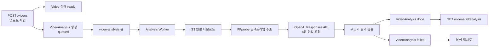

# 영상 분석 및 자동 편집 추천 기반 구현 계획

> **착수 전 계획 문서 — 아직 승인·구현되지 않았다.** 이 문서의 API·스키마는 제안이며 현행 사실이 아니다.
> 진행 승인 여부는 [backlog.md](../backlog.md) A-3, 현행 API 계약은 [api-spec.md](../api-spec.md).

## 1. 목적

사용자가 업로드한 짧은 영상을 시각적으로 분석하여 다음 정보를 제공한다.

- 영상 한 줄 요약
- 주요 주제, 장소, 사물, 행동, 분위기
- 편집에 사용할 수 있는 시각 품질 정보
- 분석 상태와 실패 시 재시도 기능

이번 분석 결과는 후속 기능인 **대주제 기반 자동 영상 선택**의 입력 데이터로 재사용한다. 사용자가 대주제를 선택하면 관련성과 품질이 높은 source 영상들을 선택하고, 기존 `ClipSpec[]` 계약으로 변환하여 현재 편집 파이프라인에 전달하는 것이 최종 방향이다.

## 2. 범위와 전제

### 2.1 이번 구현에 포함되는 범위

- source 영상 업로드 완료 후 비동기 분석 작업 자동 생성
- FFprobe를 이용한 실제 영상 길이 확인
- 영상당 최대 4개의 대표 프레임 추출
- 4개 프레임을 OpenAI Responses API의 단일 요청으로 분석
- JSON Schema 기반 구조화 결과 검증
- 분석 결과와 모델·프롬프트 버전 저장
- 분석 상태 조회 API
- 실패한 분석 재시도 API
- 큐 재시도, 멱등성, 삭제 경쟁 조건 처리
- 처리시간, 토큰 사용량, 오류 유형 관측

### 2.2 제외되는 범위

- 오디오 품질 평가
- 음량, 잡음, 배경음, 음질 점수
- OpenAI에 오디오 전달
- 긴 영상의 장면 단위 분할
- 임베딩과 벡터 검색
- 자동 편집 추천 자체
- 모델 학습 또는 파인튜닝

기존 편집 worker의 Whisper 자막 생성은 그대로 유지하지만, 이번 영상 분석 파이프라인과는 분리한다.

### 2.3 분석 단위

3초 내외의 source 영상 하나를 다음 두 가지 단위로 함께 취급한다.

1. 하나의 영상 분석 단위
2. 자동 편집 추천에서 선택할 수 있는 하나의 후보 단위

따라서 초기 구현에서는 `VideoSegment` 테이블을 만들지 않는다. 향후 긴 영상에서 부분 구간을 추천해야 할 때 장면 분할과 `VideoSegment`를 별도 확장한다.

## 3. 전체 처리 흐름



핵심 원칙은 다음과 같다.

- 영상 업로드 성공과 분석 성공은 독립적으로 관리한다.
- 분석이 실패해도 원본 영상의 `Video.status`는 `ready`를 유지한다.
- 4개 프레임은 각각 요청하지 않고 하나의 OpenAI 요청으로 전달한다.
- 병렬 처리는 프레임 단위가 아니라 영상 단위로 수행한다.
- 동일한 작업이 중복 실행되어도 결과가 망가지지 않도록 멱등성을 보장한다.
- 모델의 자유 텍스트를 그대로 사용하지 않고 구조화 출력과 애플리케이션 검증을 적용한다.

## 4. 핵심 설계 결정

### 4.1 기존 `Video.status`와 분석 상태 분리

현재 `Video.status`는 업로드 및 편집 결과 상태에 사용되고 있다. 분석 상태까지 같은 필드에 넣으면 업로드는 성공했지만 분석은 진행 중이거나 실패한 상태를 표현하기 어렵다.

분석에는 다음과 같은 별도 상태를 사용한다.

```ts
export type VideoAnalysisStatus =
  | 'queued'
  | 'processing'
  | 'done'
  | 'failed';
```

### 4.2 기존 편집 계약 재사용

현재 편집 API는 다음 계약을 사용한다.

```ts
export interface ClipSpec {
  videoId: string;
  startMs: number;
  endMs?: number;
}
```

3초짜리 source 영상 전체를 선택할 경우 추천 결과는 다음처럼 변환할 수 있다.

```json
{
  "videoId": "source-video-id",
  "startMs": 0,
  "endMs": 3000
}
```

이번 분석 기능은 기존 `/edit-jobs` 계약을 변경하지 않는다.

### 4.3 OpenAI 호출 설정

초기 기본값은 다음과 같다.

```text
Model: gpt-5.6-luna
API: Responses API
Image detail: low
Reasoning effort: none
Images per request: 최대 4장
```

초기 평가에서 품질이 부족한 경우 `gpt-5.6-terra`를 비교한다. 모델명, 이미지 detail, 타임아웃과 동시성은 코드에 직접 고정하지 않고 환경 변수로 관리한다. 운영 모델은 평가 완료 후 특정 버전으로 고정할 수 있어야 한다.

참고 문서:

- [OpenAI Images and vision](https://developers.openai.com/api/docs/guides/images-vision)
- [OpenAI Structured Outputs](https://developers.openai.com/api/docs/guides/structured-outputs)
- [OpenAI Models](https://developers.openai.com/api/docs/models)

## 5. 데이터 모델

`apps/api/prisma/schema.prisma`에 다음 모델을 추가한다.

```prisma
model VideoAnalysis {
  id                 String    @id @default(uuid()) @db.Uuid
  videoId            String    @map("video_id") @db.Uuid
  userId             String    @map("user_id") @db.Uuid
  analysisVersion    Int       @default(1) @map("analysis_version")
  status             String    @default("queued") @db.VarChar(20)

  durationMs         Int?      @map("duration_ms")
  frameTimestampsMs  Int[]     @default([]) @map("frame_timestamps_ms")

  summary            String?
  topics             String[]  @default([])
  places             String[]  @default([])
  objects             String[]  @default([])
  actions             String[]  @default([])
  moods               String[]  @default([])

  visualQualityScore Float?    @map("visual_quality_score")
  visualIssues       String[]  @default([]) @map("visual_issues")
  usableForEdit      Boolean?  @map("usable_for_edit")
  confidence         Float?

  provider           String    @default("openai") @db.VarChar(30)
  modelVersion       String    @map("model_version") @db.VarChar(100)
  promptVersion      String    @map("prompt_version") @db.VarChar(30)

  inputTokens        Int?      @map("input_tokens")
  outputTokens       Int?      @map("output_tokens")
  attempts           Int       @default(0)
  errorCode          String?   @map("error_code") @db.VarChar(100)
  errorMessage       String?   @map("error_message")

  startedAt          DateTime? @map("started_at") @db.Timestamptz(6)
  completedAt        DateTime? @map("completed_at") @db.Timestamptz(6)
  createdAt          DateTime  @default(now()) @map("created_at") @db.Timestamptz(6)
  updatedAt          DateTime  @updatedAt @map("updated_at") @db.Timestamptz(6)

  video Video @relation(fields: [videoId], references: [id], onDelete: Cascade)
  user  User  @relation(fields: [userId], references: [id], onDelete: Cascade)

  @@unique([videoId, analysisVersion])
  @@index([userId, status])
  @@index([status, createdAt])
  @@map("video_analyses")
}
```

`analysisVersion`은 모델이나 프롬프트 변경 시 기존 결과를 덮어쓰지 않고 비교하기 위한 값이다.

- 동일 버전 재시도: 기존 레코드의 `attempts` 증가
- 새 모델·프롬프트 재분석: 새 `analysisVersion` 생성
- 일반 조회: 가장 최신 버전 반환

## 6. OpenAI 분석 결과 계약

OpenAI에는 자유 형식 응답이 아니라 JSON Schema 기반 Structured Outputs를 요청한다. worker에서도 Pydantic 등의 애플리케이션 스키마로 다시 검증한다.

```json
{
  "summary": "카페 테이블 위의 디저트를 가까이서 촬영한 영상",
  "topics": ["카페", "디저트", "일상"],
  "places": ["카페"],
  "objects": ["케이크", "커피", "테이블"],
  "actions": ["디저트를 가까이 보여줌"],
  "moods": ["차분한", "감성적인"],
  "visualQuality": {
    "score": 0.86,
    "issues": [],
    "usableForEdit": true
  },
  "confidence": 0.91
}
```

시각 품질은 다음 요소만 반영한다.

- 프레임 간 급격한 불안정 또는 흔들림
- 흐림과 초점
- 밝기와 과노출
- 검은 화면
- 화면 가림
- 피사체 식별 가능 여부
- 거의 동일한 화면만 반복되는지
- 자동 편집 후보로 사용할 수 있는지

오디오 관련 필드는 생성하거나 저장하지 않는다.

## 7. 프레임 추출 정책

정확히 3초인 영상은 다음 시점에서 프레임을 추출한다.

```text
0.3초 / 1.1초 / 1.9초 / 2.7초
```

실제 길이가 달라질 수 있으므로 FFprobe 결과에 대한 상대 위치로 계산한다.

```text
10% / 36.7% / 63.3% / 90%
```

```python
timestamps = [
    duration_ms * 0.10,
    duration_ms * 0.367,
    duration_ms * 0.633,
    duration_ms * 0.90,
]
```

추출 규칙은 다음과 같다.

- 클라이언트가 전달한 `durationSeconds` 대신 FFprobe 결과를 기준으로 사용한다.
- 촬영 시작·종료 흔들림을 피하도록 첫 프레임과 마지막 프레임은 사용하지 않는다.
- 4장을 하나의 FFmpeg 작업으로 추출한다.
- JPEG로 변환하고 최대 해상도를 제한한다.
- 유사도가 매우 높은 중복 프레임을 제거한다.
- 짧은 영상은 중복 프레임을 만들지 않고 최소 1~2장만 전달할 수 있다.
- 프레임은 S3에 영구 저장하지 않는다.
- 성공과 실패에 관계없이 임시 파일을 제거한다.
- DB에는 실제 사용한 타임스탬프만 기록한다.

## 8. API 서버 구현

### 8.1 신규 모듈

```text
apps/api/src/queue/video-analysis-queue.ts
apps/api/src/services/video-analysis.service.ts
apps/api/src/routes/video-analyses.ts
```

### 8.2 업로드 확인 처리 변경

`POST /videos`의 처리 순서를 다음과 같이 확장한다.

1. S3 객체 존재 여부와 크기 확인
2. `Video.status = ready` 반영
3. `VideoAnalysis.status = queued` 생성
4. DB 트랜잭션 커밋
5. BullMQ `video-analysis` 큐에 작업 적재
6. 기존 `Video` 응답 반환

BullMQ job ID는 `analysisId`를 사용하여 중복 적재를 막는다.

큐 적재가 실패해도 원본 영상은 `ready` 상태를 유지한다. 분석 레코드는 재시도 가능한 상태로 남기며, 큐와 DB 사이에서 작업이 누락되는 경우를 위해 재적재 로직이나 reconciliation 작업을 둔다.

## 9. Analysis worker 구현

현재 편집 worker는 시작 시 Whisper 모델을 로드하므로 분석 worker와 분리한다.

```text
apps/ai-worker/src/
  analysis_worker.py
  analysis_db.py
  pipeline/
    video_analysis/
      frame_sampler.py
      openai_client.py
      prompt.py
      schema.py
      analyzer.py
```

분리 이유는 다음과 같다.

- 영상 분석 worker에는 Whisper가 필요하지 않다.
- OpenAI 호출 동시성과 FFmpeg 편집 동시성을 따로 조정할 수 있다.
- 편집 worker의 장애와 재배포가 영상 분석에 영향을 주지 않는다.
- 향후 컨테이너 스케일링 단위를 독립적으로 운영할 수 있다.

같은 Docker 이미지를 사용하되 실행 명령을 분리할 수 있다.

```text
python worker.py
python analysis_worker.py
```

worker의 한 작업은 다음 순서로 수행한다.

1. 분석 레코드와 source 영상의 소유권·삭제 상태 확인
2. 분석 상태를 `processing`으로 변경
3. S3 원본을 임시 디렉터리로 다운로드
4. FFprobe로 실제 영상 길이 확인
5. 최대 4개 프레임 추출 및 중복 제거
6. 프레임을 Base64 data URL로 변환
7. 4장을 시간순으로 OpenAI에 단일 요청
8. Structured Output 및 Pydantic 스키마 검증
9. 분석 결과와 토큰 사용량 저장
10. 임시 파일 제거

## 10. 환경 변수

`.env.example`에 다음 설정을 추가한다.

```dotenv
# OpenAI video analysis
OPENAI_API_KEY=
OPENAI_VISION_MODEL=gpt-5.6-luna
OPENAI_IMAGE_DETAIL=low

VIDEO_ANALYSIS_QUEUE_NAME=video-analysis
VIDEO_ANALYSIS_TIMEOUT_SECONDS=60
VIDEO_ANALYSIS_CONCURRENCY=3
VIDEO_ANALYSIS_AUTO_ENQUEUE=false
VIDEO_ANALYSIS_PROMPT_VERSION=v1
```

`OPENAI_API_KEY`는 API 서버가 아니라 analysis worker에만 전달한다.

`VIDEO_ANALYSIS_AUTO_ENQUEUE`는 점진적 출시를 위한 feature flag로 사용한다. 초기 배포에서는 비활성화하고 worker, DB, API 검증이 끝난 후 활성화한다.

## 11. API 계약 변경

### 11.1 기존 API

| API | 계약 변화 | 내용 |
|---|---|---|
| `GET /videos/upload-url` | 없음 | 기존 업로드 방식 유지 |
| `POST /videos` | 동작 변화 | 응답은 기존 `Video`, 내부적으로 분석 작업 자동 생성 |
| `GET /videos` | 없음 | 초기 버전에서는 분석 결과를 포함하지 않음 |
| `GET /videos/:id` | 없음 | 기존 `Video` 객체 유지 |
| `DELETE /videos/:id` | 동작 확장 | 분석 레코드 cascade 삭제 및 진행 중 결과 반영 차단 |
| `POST /edit-jobs` | 없음 | 현재 `clips[]` 계약 유지 |

`POST /videos`에는 응답 형태가 아닌 **동작 계약 변경**이 있다. 업로드 확인이 성공한 후 비동기 OpenAI 분석이 자동으로 시작된다.

기존 `Video` 객체에는 `analysisStatus`, `summary` 등을 추가하지 않는다.

- 기존 shared type 호환성을 유지한다.
- `/videos` 목록 조회에 분석 조인을 강제하지 않는다.
- 기존 클라이언트의 strict decoder 영향을 줄인다.
- 분석 데이터는 별도 리소스로 관리한다.

### 11.2 신규 분석 조회 API

```http
GET /videos/:videoId/analysis
```

처리 중 응답:

```json
{
  "success": true,
  "data": {
    "id": "uuid",
    "videoId": "uuid",
    "version": 1,
    "status": "processing",
    "result": null,
    "error": null,
    "createdAt": "2026-08-10T12:00:00.000Z",
    "completedAt": null
  }
}
```

완료 응답:

```json
{
  "success": true,
  "data": {
    "id": "uuid",
    "videoId": "uuid",
    "version": 1,
    "status": "done",
    "result": {
      "durationMs": 3012,
      "summary": "카페에서 디저트와 커피를 촬영한 영상",
      "topics": ["카페", "디저트"],
      "places": ["카페"],
      "objects": ["케이크", "커피"],
      "actions": ["디저트를 가까이 보여줌"],
      "moods": ["차분한"],
      "visualQuality": {
        "score": 0.86,
        "issues": [],
        "usableForEdit": true
      },
      "confidence": 0.91
    },
    "error": null,
    "createdAt": "2026-08-10T12:00:00.000Z",
    "completedAt": "2026-08-10T12:00:04.000Z"
  }
}
```

실패 상태도 분석 리소스 조회 자체는 성공했으므로 HTTP 200으로 반환한다. 내부 OpenAI 오류 메시지는 노출하지 않는다.

```json
{
  "success": true,
  "data": {
    "id": "uuid",
    "videoId": "uuid",
    "version": 1,
    "status": "failed",
    "result": null,
    "error": {
      "code": "OPENAI_RATE_LIMITED",
      "retryable": true
    }
  }
}
```

### 11.3 신규 재시도 API

```http
POST /videos/:videoId/analysis/retry
```

```http
202 Accepted
```

```json
{
  "success": true,
  "data": {
    "analysisId": "uuid",
    "status": "queued"
  }
}
```

재시도 규칙:

- 본인 소유의 source 영상만 가능
- `failed` 상태만 재시도
- 이미 `queued` 또는 `processing`이면 중복 작업을 만들지 않음
- `done` 상태의 강제 재분석은 일반 사용자 API에서 제공하지 않음
- 새 모델이나 프롬프트 버전 재분석은 관리자 또는 배치 작업으로 처리

### 11.4 shared types 추가

`packages/shared-types/src/domain.ts`에 다음 타입을 추가한다. 기존 `Video` 타입은 수정하지 않는다.

```ts
export type VideoAnalysisStatus =
  | 'queued'
  | 'processing'
  | 'done'
  | 'failed';

export interface VideoVisualQuality {
  score: number;
  issues: string[];
  usableForEdit: boolean;
}

export interface VideoAnalysisResult {
  durationMs: number;
  summary: string;
  topics: string[];
  places: string[];
  objects: string[];
  actions: string[];
  moods: string[];
  visualQuality: VideoVisualQuality;
  confidence: number;
}

export interface VideoAnalysis {
  id: string;
  videoId: string;
  version: number;
  status: VideoAnalysisStatus;
  result: VideoAnalysisResult | null;
  error: {
    code: string;
    retryable: boolean;
  } | null;
  createdAt: string;
  completedAt: string | null;
}
```

## 12. 오류 및 재시도 정책

### 12.1 재시도하는 오류

- 네트워크 타임아웃
- OpenAI 429
- OpenAI 5xx
- 일시적인 S3 다운로드 실패
- 구조화 결과 스키마 불일치 1회

### 12.2 재시도하지 않는 오류

- 손상된 영상
- 지원하지 않는 코덱
- 프레임을 하나도 추출할 수 없음
- OpenAI 인증 오류
- 잘못된 요청 구성
- 삭제된 영상
- 안전 정책에 따른 거절

BullMQ 기본 정책:

```text
attempts: 3
backoff: exponential, 5초
jobId: analysisId
```

DB의 `attempts`도 증가시켜 BullMQ 작업이 삭제된 이후에도 시도 횟수를 확인할 수 있게 한다.

## 13. 삭제 및 동시성

영상 삭제 도중 worker가 결과를 저장하는 경쟁 조건을 처리한다.

worker는 결과 반영 전에 다음 항목을 다시 검증한다.

- 영상이 삭제되지 않았는지
- source 영상인지
- 분석 레코드가 현재 실행 중인 버전인지
- 작업이 이미 완료되지 않았는지

삭제된 영상이라면 OpenAI 응답을 버리고 결과를 저장하지 않는다. 분석 레코드는 `Video` 관계의 `onDelete: Cascade`로 제거한다.

임시 프레임은 모든 성공·실패 경로에서 `finally` 블록으로 제거한다.

## 14. 테스트 계획

### 14.1 API 테스트

- 업로드 확인 시 분석 레코드가 정확히 1개 생성되는지
- 동일한 업로드 확인 재호출로 중복 분석이 생성되지 않는지
- 큐 적재 실패에도 `Video.status=ready`인지
- 다른 사용자의 분석 조회가 404인지
- 실패 상태만 재시도 가능한지
- 삭제 시 분석 데이터가 함께 제거되는지
- 기존 `/videos` 응답 계약이 변하지 않았는지
- OpenAPI 스키마와 shared types가 일치하는지

### 14.2 Python 단위 테스트

- 3초 영상의 프레임 시점 계산
- 짧은 영상의 중복 프레임 제거
- FFprobe 결과 파싱
- FFmpeg 프레임 추출
- OpenAI 요청에 이미지가 시간순으로 포함되는지
- 모든 이미지에 `detail=low`가 적용되는지
- 구조화 결과 파싱 및 값 범위 검증
- 429, 5xx, timeout 재시도 분류
- 임시 파일 정리
- 삭제된 영상의 결과 반영 차단

### 14.3 통합 테스트

CI에서는 Fake OpenAI client를 사용해 다음 흐름을 검증한다.

```text
업로드 → 분석 queued → worker 처리 → done → GET analysis
```

실제 OpenAI 호출은 비용과 외부 장애 영향을 피하기 위해 CI 필수 테스트가 아닌 별도 smoke test로 운영한다.

### 14.4 품질 평가 세트

최소 30개, 가능하면 100개의 실제 3초 영상을 준비한다.

- 풍경
- 음식
- 셀카
- 반려동물
- 빠른 움직임
- 야간
- 역광
- 흔들림
- 초점 불량
- 거의 동일한 프레임
- 중간에 화면이 바뀌는 영상

평가 항목:

- 한 줄 요약의 사실성
- 핵심 사물 포함률
- 주요 행동 포함률
- 존재하지 않는 내용을 생성한 비율
- `usableForEdit` 판단 정확도
- 영상당 처리시간
- 영상당 입력·출력 토큰
- OpenAI 호출 실패율

오디오 관련 평가는 수행하지 않는다.

## 15. 관측성과 보안

로그 및 Sentry에 다음 정보를 남긴다.

- `analysisId`
- `videoId`
- 분석 버전
- 모델명
- 프롬프트 버전
- 사용한 프레임 수
- OpenAI 요청 지연시간
- 전체 분석 시간
- 입력·출력 토큰
- 재시도 횟수
- 오류 분류
- OpenAI request ID

다음 정보는 로그에 남기지 않는다.

- `OPENAI_API_KEY`
- Base64 이미지
- presigned URL 전체
- 모델 원문 응답 전체
- 사용자 원본 영상 경로가 포함된 오류 문자열

운영 지표:

```text
analysis.queue.delay
analysis.duration.p50/p95
analysis.success_rate
analysis.retry_rate
analysis.openai_429_rate
analysis.schema_failure_rate
analysis.tokens_per_video
```

외부 모델에는 원본 영상 전체가 아니라 임시로 추출한 프레임만 전달한다. 사용자 영상 삭제 시 관련 분석 결과도 삭제한다.

## 16. 배포 계획

1. DB 마이그레이션 배포
2. shared types와 신규 조회 API 배포
3. `analysis_worker.py` 배포
4. `VIDEO_ANALYSIS_AUTO_ENQUEUE=false` 상태로 smoke test
5. 테스트 영상에 수동 분석 작업 실행
6. 품질, 처리시간, 토큰 사용량 확인
7. 내부 사용자 대상으로 자동 분석 활성화
8. 점진적으로 전체 사용자에게 확대
9. 필요한 경우 기존 source 영상 백필 실행

worker가 내려간 동안에도 BullMQ 작업은 유지되고 재기동 후 처리되어야 한다.

## 17. 후속 자동 영상 선택 기능

이번 분석 기능이 완료되면 자동 영상 선택은 다음 흐름으로 확장한다.

```text
사용자가 대주제 선택
→ done 상태이며 usableForEdit=true인 영상 조회
→ topics/actions/places/moods 기반 점수 계산
→ 중복 또는 유사 영상 제거
→ 목표 길이에 맞춰 영상 선택
→ 기존 ClipSpec[] 생성
→ 사용자가 결과 수정
→ 기존 POST /edit-jobs 호출
```

후속 API 후보:

```http
GET /edit-topics
POST /edit-recommendations
```

추천 요청 예시:

```json
{
  "topicId": "cafe-day",
  "candidateVideoIds": ["uuid-1", "uuid-2"],
  "targetDurationSeconds": 30,
  "stylePreset": "일상",
  "outputProfile": "short_vertical"
}
```

추천 응답 예시:

```json
{
  "recommendationId": "uuid",
  "clips": [
    {
      "videoId": "uuid-1",
      "startMs": 0,
      "endMs": 3000,
      "score": 0.91,
      "reason": "카페·디저트 주제와 일치하고 시각 품질이 좋음"
    }
  ]
}
```

기존 `/edit-jobs`에는 나중에 optional `recommendationId`를 추가할 수 있다. 이는 추천한 영상이 실제 편집에서 얼마나 유지되는지 측정하기 위한 추적값이며 기존 호출에는 영향을 주지 않는다.

## 18. 구현 순서

### 작업 1 — 계약과 DB 기반

- 분석 타입 정의
- Prisma 모델과 마이그레이션
- API 응답 스키마 정의
- `.env.example` 갱신

### 작업 2 — API와 큐

- 분석 큐 초기화
- 업로드 확인 후 분석 레코드 생성
- 멱등 큐 적재
- 분석 조회 및 재시도 API
- 소유권과 삭제 처리

### 작업 3 — Analysis worker

- FFprobe
- 최대 4프레임 추출
- OpenAI 클라이언트
- 구조화 출력 검증
- DB 상태 전이
- 오류 분류와 임시 파일 정리

### 작업 4 — 검증과 운영 준비

- API와 worker 테스트
- Docker Compose에 analysis worker 추가
- Sentry 및 운영 지표 추가
- Swagger와 `docs/api-spec.md` 갱신
- 평가 영상 실행
- feature flag 기반 점진적 활성화

## 19. 완료 조건

- [ ] 업로드 완료 후 분석 작업이 정확히 한 번 생성된다.
- [ ] 3초 영상에서 대표 프레임이 최대 4장 추출된다.
- [ ] 최대 4장이 하나의 OpenAI 요청으로 전달된다.
- [ ] 오디오가 OpenAI에 전달되거나 평가되지 않는다.
- [ ] 분석 결과가 정해진 JSON 계약으로 저장된다.
- [ ] 분석 실패에도 원본 영상은 `ready` 상태를 유지한다.
- [ ] 사용자가 분석 상태와 결과를 조회할 수 있다.
- [ ] 실패한 작업을 멱등하게 재시도할 수 있다.
- [ ] 삭제된 영상에는 분석 결과가 반영되지 않는다.
- [ ] 기존 영상·편집 API의 응답 계약이 깨지지 않는다.
- [ ] 실제 평가 영상으로 처리시간, 실패율, 토큰 사용량 기준선을 확보한다.

## 20. API 계약 변경 요약

이번 구현은 기존 API의 파괴적 변경을 피한다.

- 기존 `Video` 응답: 변경하지 않음
- 기존 `/edit-jobs`: 변경하지 않음
- `POST /videos`: 응답은 같지만 분석 작업을 자동 생성하는 동작 추가
- `DELETE /videos/:id`: 관련 분석 정리 동작 추가
- `GET /videos/:videoId/analysis`: 신규
- `POST /videos/:videoId/analysis/retry`: 신규
- shared types: 기존 타입 수정 없이 분석 관련 타입 추가

이 계약을 유지하면 기존 클라이언트는 수정 없이 업로드와 편집을 계속 사용할 수 있고, 신규 클라이언트만 분석 조회 기능을 선택적으로 사용할 수 있다.
